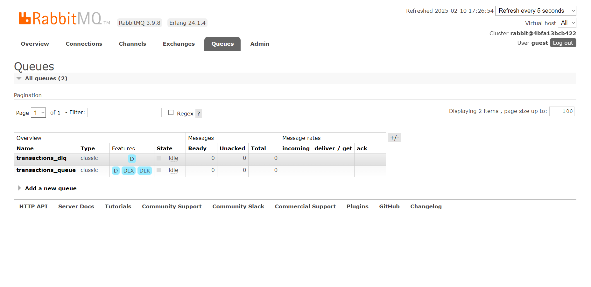

# CenterSA - Backend

## Descrição do Projeto
Desenvolvi uma API com Java e Spring, ela consome a minha API AccountBankSA, assim tendo acesso as contas bancárias, ela tem como função orquestrar depósitos, saques e transferência entre contas cadastradas, essa API utiliza um banco de dados não relacional MongoDB, para guardar registros de operações realizadas num formato Json, utilizei o RabbitMQ como sistema de mensageria para as operações realizadas, e realizar operações a partir de mensagens em formato string que ficam armazenadas na queue. Todo sistema está em um contêiner no Docker.

- Intalção do projeto no docker-compose, com o seguinte comando no terminal bash: **docker-compose up -d --build**

## Tecnologias Utilizadas
- **Java**: 17.
- **Spring Boot**: Framework utilizado.
- **Banco de Dados**: MongoDB.
- **Ferramentas**: Maven, Docker Compose, RabbitMQ, Swagger.
- **API Externa**: AccountBankSA.
- **JUnit/Mockito**: Testes unitários.
- **Docker**: Docker Compose.

## Funcionalidades

- Operação de saque
- Operação de depósito
- Operação de transferência entre contas cadastradas
- Registro de operações no banco de dados
- Sistema de mensageria
- Queue de operações
- Integração com APIs externas

## Modelo de teste Json

- Esse modelo pode ser usado tanto para requisições HTTP, quanto no Rabbitm:
{
  "originAccountNumber": "57411542",
  "destinationAccountNumber": "57432637",
  "amount": 200.0
}

**Imagens**

  
  
  
  
  

